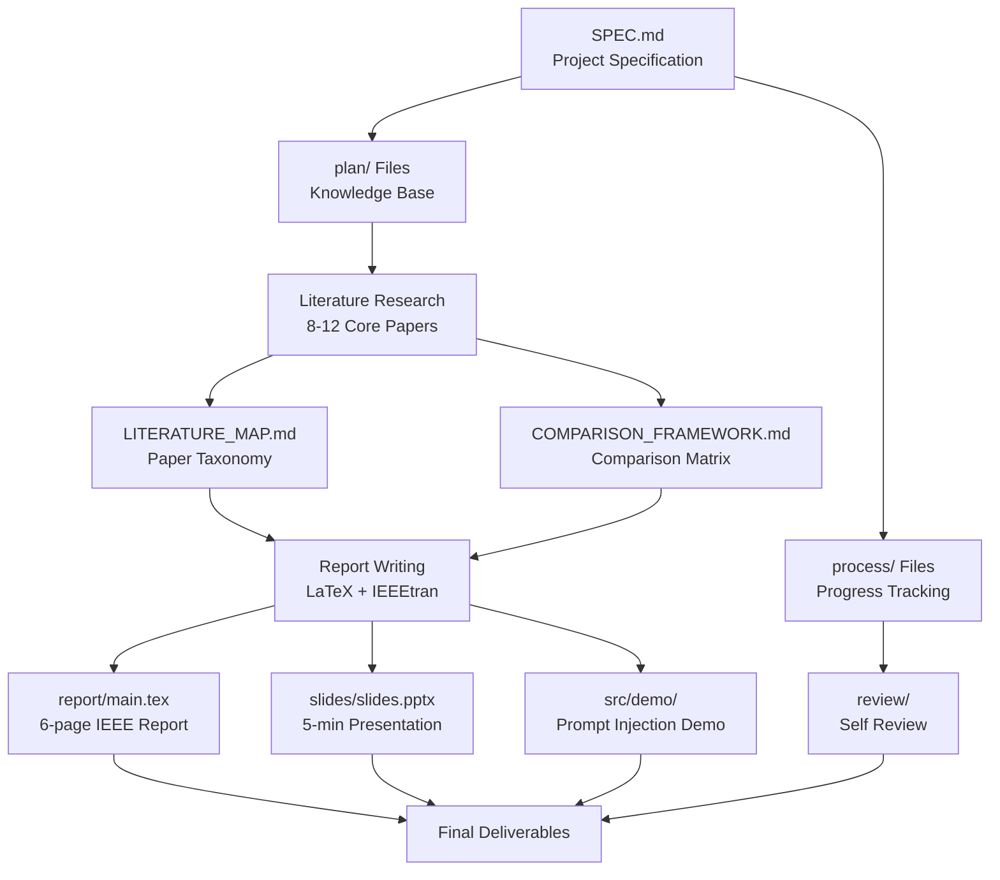
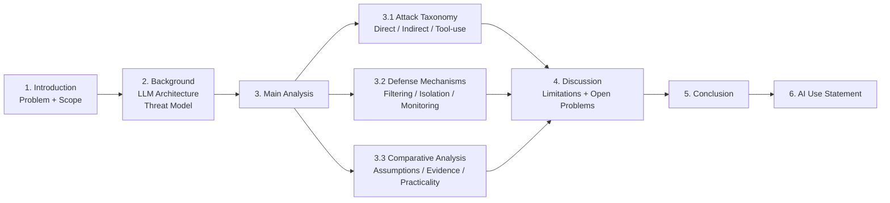

## Product Overview

CS5293 Topics on Information Security 课程的期末小组项目（5人团队），选题为 **Topic 17: Prompt Injection and Tool-use Attacks in LLM Applications**。本项目是一个文献综述型研究项目，需要围绕 LLM 应用中的 Prompt Injection 和 Tool-use 攻击进行系统性文献调研、批判性分析和综合洞察，同时附带一个小型可运行 Demo 辅助演示。

## Core Features

### 1. SPEC.md 与项目管理文件体系

- 生成 `SPEC.md` 记录项目目标、功能列表、非目标、技术约束、验收标准
- 按照 `AGENT_STARTUP.md` 规范生成 `plan/`、`process/`、`review/` 下所有管理文档
- 对 AGENT_STARTUP.md 的软件项目模板进行文献综述项目适配（如 INTERFACES.md 改为 LITERATURE_MAP.md，SCHEMAS.md 改为 COMPARISON_FRAMEWORK.md 等）

### 2. IEEE 格式学术报告（不超过 6 页双栏 + 参考文献）

- 基于 Template/LaTex/ 下的 IEEE 模板（IEEEtran.cls）撰写
- 结构：Introduction → Background & Threat Model → Main Analysis（攻击分类 + 防御方案对比） → Discussion → Conclusion → AI Use Statement
- 核心文献 8-12 篇深度分析，总文献 10-20 篇覆盖
- 按攻击维度（直接注入 / 间接注入 / tool-use 攻击）和防御维度（输入过滤 / 架构隔离 / 输出检测）组织比较

### 3. PDF 幻灯片（5 分钟演示 + 2 分钟 Q&A）

- 聚焦大图景：问题动机、文献组织框架、关键技术要点、未解决问题
- 包含 Demo 演示截图或实时展示环节
- 5 人分工展示方案

### 4. Prompt Injection Demo（可运行小型演示）

- 一个轻量级 Python 脚本或 HTML 页面，演示 prompt injection 攻击场景
- 展示：直接注入绕过系统指令、间接注入通过外部数据源注入
- 如果 API 调用不可行，降级为预录制截图/录屏

### 5. 5 人分工方案与协作流程

- 按报告章节 + 文献领域交叉分工
- 每人负责明确的文献子集和报告段落

### 6. README.md 与操作指南

- 项目概述、目录结构说明、构建/编译报告的步骤、Demo 运行方法

## Tech Stack

### 文档与报告

- **LaTeX**: 使用项目自带的 `IEEEtran.cls` IEEE 会议模板（`Template/LaTex/`）
- **BibTeX**: 文献引用管理（`references.bib`）
- **Markdown**: 所有过程管理文档（plan/, process/, review/）

### Demo（可选）

- **Python 3.10+**: Demo 脚本语言
- **OpenAI API / 本地 LLM (ollama)**: Prompt injection 演示的 LLM 后端
- **HTML/CSS/JavaScript**: 如果做 Web 形式的交互式 Demo 页面

### 幻灯片

- **LaTeX Beamer** 或 **PowerPoint/PPTX**: 幻灯片制作

### 工具链

- **Git**: 版本控制与协作
- **Make / latexmk**: LaTeX 编译自动化

## Implementation Approach

本项目的核心是文献综述，不是软件开发。因此需要对 `AGENT_STARTUP.md` 的软件项目工作流进行适配：

1. **文件体系适配**：AGENT_STARTUP.md 中面向代码的文件（INTERFACES.md, SCHEMAS.md, API_CHANGELOG.md）重新定义用途：

- `INTERFACES.md` → `LITERATURE_MAP.md`：文献索引与分类地图
- `SCHEMAS.md` → `COMPARISON_FRAMEWORK.md`：论文比较矩阵（攻击类型、防御机制、假设、评估方法、局限性）
- `API_CHANGELOG.md` → 标记为 N/A 或用于记录报告结构变更
- `ARCHITECTURE.md` → 报告的逻辑架构与章节依赖关系
- `src/` → `src/demo/`：仅存放 Demo 代码
- `docs/` → 最终交付文档（报告 PDF、幻灯片 PDF）

2. **报告内容架构**：围绕 Topic 17 设计报告的分析框架

- **攻击分类维度**：Direct Prompt Injection / Indirect Prompt Injection / Tool-use & Agent Exploitation
- **防御分类维度**：Input Sanitization & Filtering / Instruction Hierarchy & Privilege Separation / Output Monitoring & Guardrails / Architectural Isolation (Sandboxing)
- **比较维度**：Threat model assumptions / Evaluation methodology / Empirical evidence strength / Deployment practicality

3. **Demo 实现策略**：采用渐进降级方案

- 首选：Python 脚本调用 LLM API，实时演示 prompt injection
- 备选：使用本地 ollama 模型避免 API 依赖
- 最终降级：预录制演示 + 截图

## Implementation Notes

### 适配 AGENT_STARTUP.md 的关键决策

- 保留 Phase 0-5 的流程框架，但将"代码实现"替换为"报告撰写"
- Phase 3 (Implementation) = 撰写 LaTeX 报告各章节 + 制作幻灯片 + 编写 Demo
- Phase 4 (Testing) = 校对报告、验证引用准确性、检查格式合规性、测试 Demo
- `CURRENT_TASK.md` 的步骤将以报告章节为粒度

### LaTeX 编译

- 基于已有模板 `Template/LaTex/CS5293-project-template.tex` 改写，保留 `IEEEtran.cls` 和 `references.bib`
- 报告源文件放在 `report/` 目录，与模板分离
- 需要将作者块从 3 人扩展为 5 人

### 5 人分工方案

| Member | Literature Focus | Report Section | Slides |
| --- | --- | --- | --- |
| M1 (Coordinator) | Overview + Taxonomy | Introduction + Conclusion | Opening + Closing |
| M2 | Direct Prompt Injection | Background (attack types) | Attack overview slides |
| M3 | Indirect Prompt Injection | Main Analysis: Attack comparison | Attack deep-dive slides |
| M4 | Defense mechanisms | Main Analysis: Defense comparison | Defense slides |
| M5 | Tool-use attacks + Demo | Discussion + Demo | Demo + Q&A prep |


## Architecture Design

### 项目逻辑架构



### 报告内容架构



## Directory Structure

```
project-root/
├── SPEC.md                          # [NEW] Project specification: goals, features, non-goals, constraints, acceptance criteria
├── README.md                        # [NEW] Project overview, build instructions, demo usage guide
├── .gitignore                       # [NEW] Standard ignores: tmp/, .env, *.local.*, __pycache__/, etc.
│
├── plan/                            # Knowledge base (adapted from AGENT_STARTUP.md)
│   ├── AGENT_STARTUP.md             # [EXISTING] Workflow guide — no modification
│   ├── PROJECT_OVERVIEW.md          # [NEW] Goals, feature list, non-goals, acceptance criteria (mirrors SPEC.md in AGENT_STARTUP format)
│   ├── ARCHITECTURE.md              # [NEW] Report logical architecture, chapter dependencies, literature organization framework
│   ├── LITERATURE_MAP.md            # [NEW] (Replaces INTERFACES.md) Full paper index with taxonomy: each paper's category, key contribution, methodology, and relevance
│   ├── COMPARISON_FRAMEWORK.md      # [NEW] (Replaces SCHEMAS.md) Structured comparison matrix: attack type, defense mechanism, threat model, evaluation method, limitations per paper
│   ├── CONSTRAINTS.md               # [NEW] Tech stack (LaTeX, Python), IEEE format rules, page limits, citation style, deadline constraints
│   ├── DIR_MAP.md                   # [NEW] One-line purpose for every folder and key file in the project
│   ├── ITERATION_LOG.md             # [NEW] Structured log of each work iteration
│   ├── CHANGELOG.md                 # [NEW] Human-readable narrative changelog
│   ├── API_CHANGELOG.md             # [NEW] Marked N/A for literature survey project; reserved for report structure changes if needed
│   └── TECH_DEBT.md                 # [NEW] Known issues, incomplete sections, weak arguments to revisit
│
├── process/                         # Progress tracking
│   ├── USER_REQUIREMENTS.md         # [EXISTING] User needs record — update status field
│   ├── PROGRESS.md                  # [NEW] Milestone-level checkboxes: literature search → report draft → slides → demo → final review
│   └── CURRENT_TASK.md              # [NEW] Breakpoint-resume state for current work step
│
├── report/                          # [NEW] LaTeX report source (adapted from Template/LaTex/)
│   ├── main.tex                     # [NEW] Main report file based on IEEEtran template, restructured for Topic 17
│   ├── references.bib               # [NEW] BibTeX entries for all cited papers (10-20 entries)
│   ├── IEEEtran.cls                 # [COPY] IEEE class file from Template/LaTex/
│   ├── sections/                    # [NEW] Individual section files for modular editing
│   │   ├── introduction.tex         # [NEW] Problem statement, motivation, scope definition
│   │   ├── background.tex           # [NEW] LLM architecture basics, prompt processing, tool-use paradigm, threat model
│   │   ├── analysis_attacks.tex     # [NEW] Attack taxonomy: direct injection, indirect injection, tool-use exploitation
│   │   ├── analysis_defenses.tex    # [NEW] Defense survey: input filtering, instruction hierarchy, output monitoring, sandboxing
│   │   ├── analysis_comparison.tex  # [NEW] Cross-cutting comparison: assumptions, evidence quality, deployment feasibility
│   │   ├── discussion.tex           # [NEW] Limitations, disagreements, open problems, future directions
│   │   ├── conclusion.tex           # [NEW] Key takeaways summary
│   │   └── ai_statement.tex         # [NEW] AI Use Statement with prompts and verification description
│   └── figures/                     # [NEW] Figures directory
│       └── taxonomy.png             # [NEW] Attack/defense taxonomy diagram
│
├── slides/                          # [NEW] Presentation materials
│   └── slides.pptx                  # [NEW] 5-minute presentation slide deck
│
├── src/                             # Demo code
│   └── demo/                        # [NEW] Prompt injection demonstration
│       ├── prompt_injection_demo.py # [NEW] Python script demonstrating direct & indirect prompt injection scenarios
│       ├── requirements.txt         # [NEW] Python dependencies (openai / ollama client)
│       └── README.md                # [NEW] Demo setup and usage instructions
│
├── review/                          # [NEW] Per-iteration self review outputs
│   └── (REVIEW files created per iteration)
│
├── docs/                            # [NEW] Final deliverable PDFs
│   └── (compiled report.pdf and slides.pdf placed here)
│
├── Template/                        # [EXISTING] IEEE templates — reference only, do not modify
│   ├── LaTex/
│   │   ├── CS5293-project-template.tex
│   │   ├── CS5293-project-template.pdf
│   │   ├── IEEEtran.cls
│   │   ├── references.bib
│   │   └── fig1.png
│   └── Word/
│       └── CS5293-project-template.doc
│
└── tmp/                             # [NEW] Scratch files — gitignored
```

## Agent Extensions

### Skill

- **pdf**
- Purpose: 读取 `CS5293_Group_Project.pdf` 获取项目要求细节；后续编译生成的报告 PDF 进行校验
- Expected outcome: 准确提取 PDF 中的评分标准、格式要求等关键信息

- **pptx**
- Purpose: 创建 5 分钟演示用的幻灯片 `slides/slides.pptx`
- Expected outcome: 生成结构完整、设计美观的演示文稿，包含攻击分类图、防御对比表、Demo 截图等

### SubAgent

- **code-explorer**
- Purpose: 在迭代过程中检索项目文件结构变化，确认文件一致性
- Expected outcome: 确保 plan/ 文件与实际目录结构同步，无遗漏文件